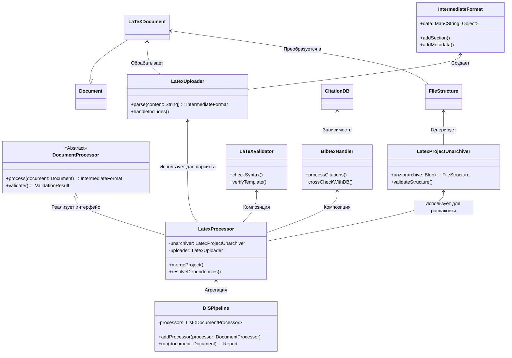

```mermaid
classDiagram
 direction BT

 %% Базовые классы DIS
 class DocumentProcessor {
 <<Abstract>>
 +process(document: Document): IntermediateFormat
 +validate(): ValidationResult
 }

 class DISPipeline {
 -processors: List~DocumentProcessor~
 +addProcessor(processor: DocumentProcessor)
 +run(document: Document): Report
 }

 class IntermediateFormat {
 +data: Map~String, Object~
 +addSection()
 +addMetadata()
 }

 %% Существующие классы с заглушками
 class LatexUploader {
 +parse(content: String): IntermediateFormat
 +handleIncludes()
 }

 class LatexProcessor {
 -unarchiver: LatexProjectUnarchiver
 -uploader: LatexUploader
 +mergeProject()
 +resolveDependencies()
 }

 class LatexProjectUnarchiver {
 +unzip(archive: Blob): FileStructure
 +validateStructure()
 }

 %% Дополнительные компоненты
 class LaTeXValidator {
 +checkSyntax()
 +verifyTemplate()
 }

 class BibtexHandler {
 +processCitations()
 +crossCheckWithDB()
 }

 %% Наследование и связи
 LatexProcessor --|> DocumentProcessor : Реализует интерфейс
 LatexProcessor --> LatexProjectUnarchiver : Использует для распаковки
 LatexProcessor --> LatexUploader : Использует для парсинга
 LatexProcessor --> LaTeXValidator : Композиция
 LatexProcessor --> BibtexHandler : Композиция
 LatexUploader --> IntermediateFormat : Создает
 DISPipeline --> LatexProcessor : Агрегация
 LatexProjectUnarchiver --> FileStructure : Генерирует
 BibtexHandler --> CitationDB : Зависимость

 %% Новые связи для интеграции
 Document <|-- LaTeXDocument
 LatexUploader --> LaTeXDocument : Обрабатывает
 FileStructure --> LaTeXDocument : Преобразуется в
```