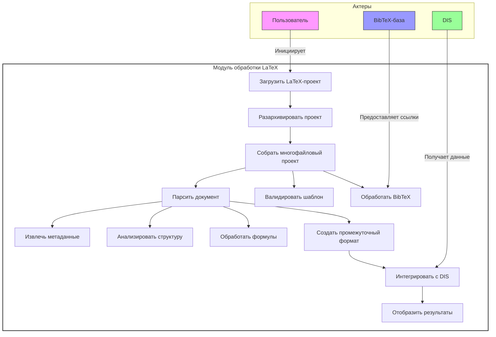

```mermaid
flowchart TD
    subgraph Система[Модуль обработки LaTeX]
        A1[Загрузить LaTeX-проект] --> A2[Разархивировать проект]
        A2 --> A3[Собрать многофайловый проект]
        A3 --> A4[Парсить документ]
        A4 --> A5[Извлечь метаданные]
        A4 --> A6[Анализировать структуру]
        A4 --> A7[Обработать формулы]
        A3 --> A8[Валидировать шаблон]
        A3 --> A9[Обработать BibTeX]
        A4 --> A10[Создать промежуточный формат]
        A10 --> A11[Интегрировать с DIS]
        A11 --> A12[Отобразить результаты]
    end

    subgraph Актеры
        Пользователь -->|Инициирует| A1
        DIS -->|Получает данные| A11
        BibTeX-база -->|Предоставляет ссылки| A9
    end

    style Пользователь fill:#f9f,stroke:#333
    style DIS fill:#9f9,stroke:#333
    style BibTeX-база fill:#99f,stroke:#333
    style Система fill:#fff,stroke:#333,stroke-width:2px
```