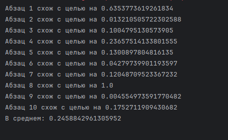
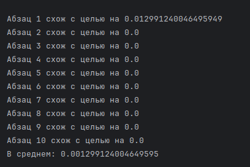
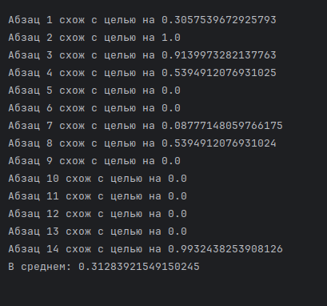

Были проведены эксперементы с текстами разной направленности, взятых из научных работ из открытых источников. В качестве
примера были взяты работы по физике и машинному обучению. Для удобства будем называть их работа №1 и работа №2.
В результате эксперимента с программой были получены следующие результаты:

Для темы работы №1 и содержания работы № 1:

Для темы работы №1 и содержания работы № 2:

Для темы работы №2 и содержания работы № 1:

Для темы работы №2 и содержания работы № 2:

Можно заметить, что для содержания, которое соответствует теме, совпадение на 2-3 порядка больше, чем для
несоответстующих текстов.